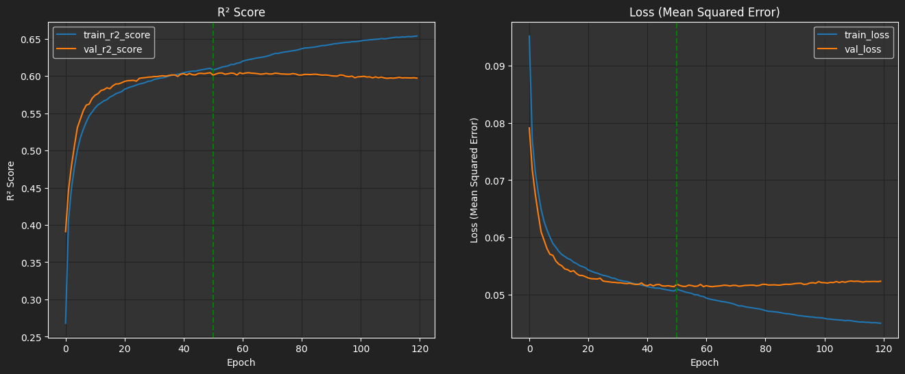
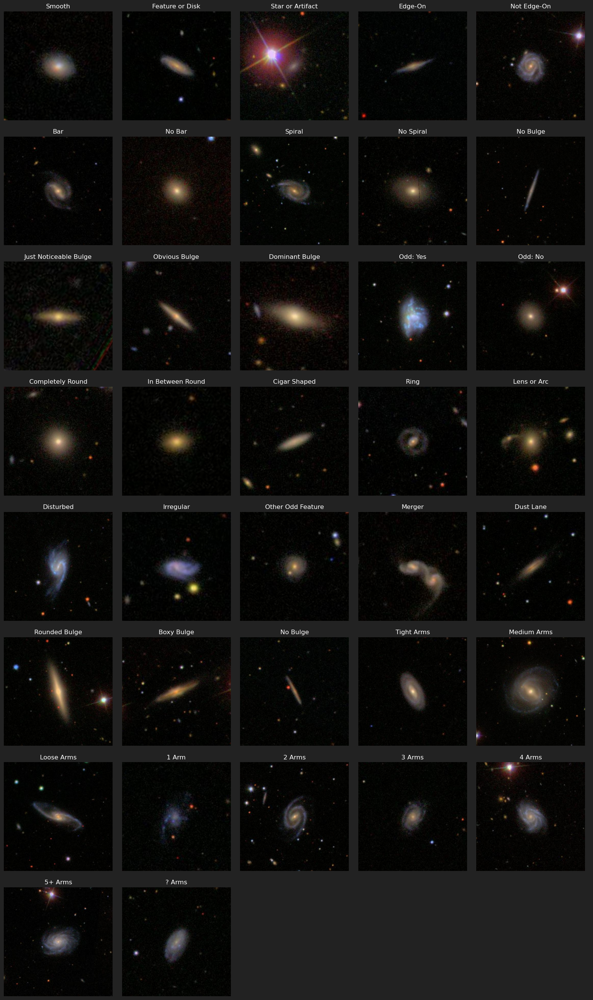

# Galaxy Morphology "Classification" (Project 4)

Using a Convolution Neural Network (CNN), we trained a regression model on tens of thousands of images of galaxies to make predictions on what people would classify a galaxy as. This is a regression because we are not directly classifying galaxies, but rather predicting the fraction of people who would classify the galaxy in such a way. 

## Group Members
- Zachary Aaronson
    - Data, model, training
- Kali Schoenrock
    - Presentation
- Jason Stone
    - Visualizations

## Setup
### Data Sources
Data and images were collected from the Galaxy Zoo 2 project which uses images from the Sloan Digital Sky Survey.

Links to files that must be downloaded:
- [https://data.galaxyzoo.org/#section-12](https://data.galaxyzoo.org/#section-12)
    - gz2_hart16.csv (364 MB)
- [https://zenodo.org/record/3565489#.Y3vFKS-l0eY](https://zenodo.org/record/3565489#.Y3vFKS-l0eY)
    - gz2_filename_mapping.csv (13 MB)
    - images_gz2.zip (3.4 GB)

### File Structure
Many files are used and generated that are not included in this repository due to size. The below file structure shows where downloaded files should be placed and where generated files will be created.

```
Galaxy_Morphology_Classification
├── 📁 data
│   ├── 📁 images
│   │   └── *.jpg (extracted files from images_gz2.zip)
│   ├── 📁 images_processed  🗲
│   │   └── *.png (empty after splitting test and train)
│   ├── 📁 model
│   │   ├── 📁 checkpoints  🗲
│   │   ├── 🌌 GalaxyConfidenceModel.keras  🗲
│   │   └── 📘 training_log.csv  🗲
│   │   └── 📗 Model_Tracking.xlsx
│   ├── 📁 test_images  🗲
│   │   └── *.png
│   ├── 📁 train_images  🗲
│   │   └── *.png
│   ├── 📖 galaxy_data.sqlite  🗲
│   ├── 📘 gz2_filename_mapping.csv
│   ├── 📘 gz2_hart16.csv
│   └── 🔢 training_images_array.npy  🗲
├── 📁 images
├── 📔 *.ipynb (3 files)
├── 📄 README.md
└── ⚙️ .gitignore

🗲 = Generated while running notebooks or scripts
```

### Packages
- Matplotlib
- Numpy
- OpenCV
- Pandas
- Scikit-learn
- Scipy
- Tensorflow/Keras

## Preprocessing Data and Images
Data and images processing code can be found in [data_image_cleaning.ipynb](data_image_cleaning.ipynb).

### Data
The data from the two csv files (`gz2_filename_mapping.csv` and `gz2_hart16.csv`) are loaded with the correct data types. Most of the columns from `hart16` are skipped as we only want a few interesting columns and the 37 '_debiased' columns that will be the `y` for training our model. Duplicates are found and removed, rows with null values are removed, and the data is merged.

Next, the `asset_id` column values are compared to the file names of all the JPG the images in `data\images\`. Rows that do not have a corresponding image are removed and images that do not have a row of data will not be processed in later steps.

Following that, we then create a new column, `class_reduced`, that will be used to stratify our data for testing and training to make sure we have a proportional distribution of rarer classes in both data sets. The value from the `gz2_class` is used to create the values for this new column, with very rare classes being combined into more general classes and super rare classes being placed into a single group.

Finally, we save our 239,267 row, 45 column DataFrame to an SQLite database, `galaxy_data.sqlite`.

### Images
The original images found in `images_gz2.zip` and extracted to `data\images\` are 424×424 color jpg files. A function was written to find the central feature and crop and/or scale down the image into a 106×106 grayscale png files using the following steps.

1. Read image with OpenCV from JPG
2. Convert to grayscale
3. Gaussian Blur
    - smooths the image a small amount to remove some noise
4. Threshold
    - As images of space have a near black background, this is a simple step that makes features obvious for later steps
5. Dilate threshold
    - slightly grow the all white regions to remove small holes and lightly pad the features
6. Find Contour with a minimum area with center closest to the center of image
    - Finds the distinct features and isolates the one in the center of the image which is the galaxy the data refers to.
7. Get bounding box of contour
    - Finds the full size of the detected feature
8. Check if the bounding box is fully contained inside the target rectangles
    - This step determines what the crop/scale step does
9. Crop/Scale
    - If inside smallest rectangle crop only
    - If inside second rectangle crop to second rectangle, then scale
    - Otherwise, scale
10. Save the final grayscale image as PNG

Two examples of this process are show below:


## Model
We used a Convolution Neural Network created with Keras and Tensorflow. A slightly modified section of the code is shown below with the different layers, compiling the model and fitting the model. The full code can be found in [model_training.ipynb](model_training.ipynb). A separate `.py` file was created to run the model directly from the console in an effort to minimize any other processes running during training. It contains only the code necessary to load the data and images, then train the model (new or continue) and save it. All adjustable values are the same between the two files. This file was used to create the final model and can be found at [model_training.py](model_training.py).

The model takes in 106×106 grayscale (single channel) png files that have been converted to Numpy arrays with values in the range [0, 1]. Originally the arrays were `float64` but were cast to `float32` to half the memory usage. For the _training data_, this array is saved as a `.npy` file in [training_images_array.npy](data/training_images_array.npy) so training can begin quicker without having to load each of the 179,450 images.

A custom R² metric was created as the built-in keras version only works with tensorflow 2.13.0 or higher and caused other errors when used.
```py
def r2_score(y_true, y_pred):
    SS_res = tf.reduce_sum(tf.square(y_true - y_pred)) 
    SS_tot = tf.reduce_sum(tf.square(y_true - tf.reduce_mean(y_true))) 
    return (1 - SS_res/(SS_tot + tf.keras.backend.epsilon()))
```

Testing out different combinations on a smaller set of data for short epochs as well as the final run is documented in [Model_Tracking.xlsx](data/model/Model_Tracking.xlsx).

The choices for this model were made to balance _training speed_ vs _"accuracy"_ as training was run on a single laptop on the CPU.

### Code for CNN Model
```py
model = Sequential()

# Add convolution layers
model.add(Conv2D(32, (3, 3), activation='relu', input_shape=(106, 106, 1)))
model.add(MaxPooling2D((2, 2)))

model.add(Conv2D(64, (3, 3), activation='relu'))
model.add(MaxPooling2D((2, 2)))

model.add(Conv2D(128, (3, 3), activation='relu'))
model.add(MaxPooling2D((2, 2)))
model.add(Dropout(0.2, seed=RANDOM_STATE))

# Flatten the output from convolution layers
model.add(Flatten())

# Add dense (fully connected) layers
model.add(Dense(128, activation='relu'))
model.add(Dropout(0.2, seed=RANDOM_STATE))

model.add(Dense(64, activation='relu'))

# Add the output layer with 37 units (for 37 classes)
model.add(Dense(37, activation='sigmoid'))

# --- --- --- ---
# Compile the model
model.compile(optimizer='adam', loss='mse', metrics=[RootMeanSquaredError(), r2_score])

# Train the model
model.fit(X_train_images,
          y_train,
          epochs=120,
          callbacks=callbacks_,
          batch_size=2_000,
          validation_split=0.1)
```

### Callbacks
A variety of callbacks were used during training for various purposes.
- ModelCheckpoint
    - Saves the weights every epoch
- EarlyStopping
    - End the training if _loss_ is stagnant for 7 epochs
- LearningRateScheduler
    - Reduce the learning rate every 10 epochs by 0.8
- ReduceLROnPlateau
    - Reduce the learning rate by a factor of 10 if _loss_ plateaus for 5 epochs
- CSVLogger
    - Save information on each epoch to a CSV file, continue the file if training is continued later
    - This file can be found at [training_log.csv](data/model/training_log.csv).

## Results
The model was trained on a `Windows 10 i7-6700HQ 2.60 GHz 16 GB RAM Dell Laptop` for **120** epochs in two parts which took a total time of **30:44:11**. The graphs of the loss and R² score over the training period are shown below. We would like to thank this six year old laptop for its slow but steady, hot and intensive work to save the newer, 3x faster baby laptop from having to do it.



As the graphs show, after epoch 50, the model began to overfit and no additional learning was done. Because of this, we used the model as it was from **epoch 50** as the final model for testing and predictions.

### Testing
After evaluating the model with 59,817 test images the final metrics were:
- Loss (Mean Squared Error): **0.0513**
- Root Mean Squared Error: **0.2265**
- R² Score: **0.6049**

Overall, these results were decent and could be improved. For our first time with with a CNN, little experience with neural networks and less than two weeks, it was pretty good.

The final model can be found here: [GalaxyConfidenceModel.keras](data/model/GalaxyConfidenceModel.keras)
- Note: to load the model you will need to use the following, where `r2_score` is the above custom R² function:
     ```py
     load_model("data/model/GalaxyConfidenceModel.keras", custom_objects={'r2_score': r2_score})
     ```

### Potential Improvements
Possible improvements that can be made but we did not have time to do or did not know how to complete:
- Use full color images (3 channels)
- Use "val_loss" or other validation metric for `EarlyStopping` and `ReduceLROnPlateau`.
    - This was a mistake that would have saved lots of computing time.
- Data augmentation
    - rotate and mirror images to increase training size
- Load training images in batches so there is not an 8GB array of images
- Use a GPU (no longer supported on Windows with tensorflow 2.11+)
    - An attempt was made to use tensorflow 2.10 on Windows 11 with an RTX 3070 Ti. The GPU was detected but memory errors still occurred even with a smaller image set.
- Change layer properties, add more layers
    - `BatchNormalization`
    - More `Dropout` layers, these had a significant effect on training time
- Use class or sample weights
- Use a custom output layer that would guarantee sections of predictions were either 0 or summed to 1.0
    - Example would be to use 'softmax' on the first 3 outputs as they are answers to question 1 of the question tree.
- Use an ensemble of models
- Use a hierarchy of CNN models for each of the 11 questions in the tree.
    - Would need to determine which images should be used for each model
    - A prediction would then use conditionals to output a result
    - Would be more difficult to test/evaluate

## Example Images
Hand selected images that best represent each class.



## Citations
- Willett et al. (2013, MNRAS, 435, 2835, DOI: [10.1093/mnras/stt1458](https://doi.org/10.1093/mnras/stt1458))
    - Galaxy Zoo 2
- Hart et al. (2016, MNRAS, 461, 3663, DOI: [10.1093/mnras/stw1588](https://doi.org/10.1093/mnras/stw1588))
    - Debiased data
- Sky Map [https://in-the-sky.org/data/constellations_map.php](https://in-the-sky.org/data/constellations_map.php?latitude=37.1305&longitude=-113.5083&timezone=-07%3A00)
- Other Galaxy Images from Hubble Space Telescope

### Inspiration, Ideas, and Sample Code
- Kaggle Competition 2014: [Galaxy Zoo - The Galaxy Challenge](https://www.kaggle.com/competitions/galaxy-zoo-the-galaxy-challenge/discussion/7722)
    - This challenge used a much smaller set of images instead of the full set
- https://sander.ai/2014/04/05/galaxy-zoo.html
    - Kaggle Competition winner
    - used `Theano` and `pylearn2` (no longer maintained)
- https://jayspeidell.github.io/portfolio/project07-galazy-zoo/
    - used `PyTorch`

